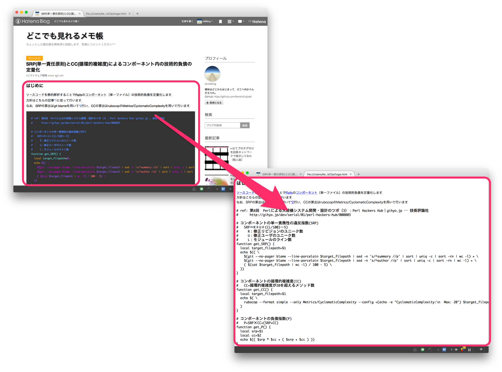

# WebClip
Extract the content including HTML tags from web page (like [evernote web clipper](https://evernote.com/intl/jp/webclipper/)).


## Usage
```sh
ruby web_clip.rb [URL]

# e.g.
ruby web_clip.rb http://ni66ling.hatenadiary.jp/entry/2015/06/25/013640
```

## License
The BSD License  
The original code was written by [Nakatani Shuyo](http://labs.cybozu.co.jp/blog/nakatani/2007/09/web_1.html).
